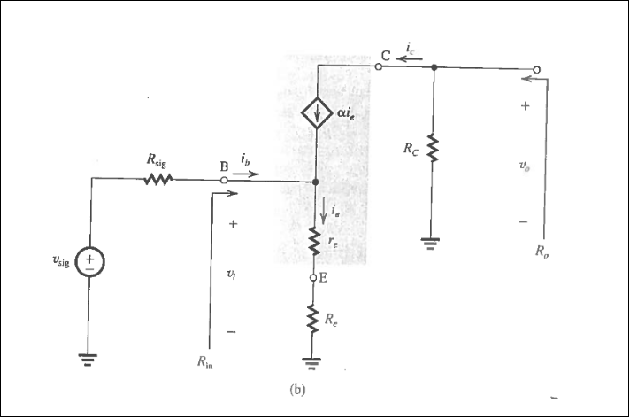
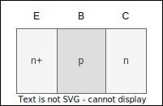

Published on: 2024-11-28

# Small Signal Analysis (LEC 21)

## Classical Bias Arrangement (LEC 22)
### 1. Biasing of Discrete-Circuit BJT Amplifiers
- The DC bias network needs to satisfy two main requirements:
	- Establish a predictable/stable $I_C$ (and $I_E$), so that $g_m=\frac{I_C}{V_T}$ is also *stable and predictable*
	- Establish a suitable $V_{CE}$ that allows for sufficient swing in output $V_o$
	
	**Note:** We know from Common Emitter Amp that $A_r=-\frac{I_CR_C}{V_T}=g_mR_C$ 

The following two schemes are not recommended "**Bad Approaches**"

Reasoning:
*a.* small variations in $V_{BE}$ results in large variations in $i_c$
*b.* $I_C$ is not reasonably predictable

**Classical Discrete Bias Arrangement**
We will instead use this arrangement, the addition of $R_E$ provides *negative feedback* and stabilizes the Q-point

*From (b.)* by doing KVL on 'L' we can find:
$$V_{BB}-I_BR_B-V_{BE}-I_ER_E=0$$
Then using: $I_B=\frac{I_E}{\beta+1}$, we can find: 
$$I_E=\frac{V_{BB}-V_{BE}}{R_E+\left( \frac{R_B}{\beta+1} \right)}$$
Thus, for stable and predictable $I_E/I_C$ we should ensure the following:
1. $V_{BB}>>V_{BE}\approx0.7$
2. $\frac{R_E>>R_B}{\beta+1}$
And we will know: $I_E\approx \frac{V_{BB}}{R_E}$

#### Rules of Thumb For Classical BJT Arrangement
- This arrangement has the tradeoff of reduced available gain and swing
- Therefore, the following starting point/rules are recommended:

1. **1/3 Rule of Thumb**
	We set: $V_{BB}\approx \frac{V_{CC}}{3}$, $V_{CE}\approx \frac{V_{CC}}{3}$(at Q point),$V_{RC}\approx \frac{V_{CC}}{3}$
	*Since* $V_E=V_B-0.7\approx V_B$ in **active mode**, then we can say that: $V_{RE}\approx \frac{V_{CC}}{3}$
	- This enables some negative swing in $V_{CE}$
	- S.S gain is reasonably high bc closer to EOS then EOC
	
2. **Divider Current Rule of Thumb**$$I_B=\frac{I_E}{\beta+1}\approx \frac{I_E}{100}<<I_{DIV}$$*Such that* $V_B\approx \frac{V_{CC}R_2}{R_1+R_2}$, so we *neglect* $I_B$ 
	- Here we are creating negative feedback to stabilize the $V_B$, $R_E$ provides negative feedback which stabilizes the bias current
#### **Example:**

*Notes*: 
1. Setting $I_{DIV}=I_E$ would have resulted in a design closer to: $V_i$
## 2. Small Signal Input Resistances
We define the following equations:
$$g_m=I_C/V_T,\;r_{\pi}=V_{BE}/I_B=\beta/g_m$$
$$r_e=V_{be}/i_b=\beta/g_m,\;A_V=V_{CE}/V_{be}=-g_mR_C$$

## 4. Equivalent Circuit Models For BJT
- These circuits yield equivalent small-signal currents/voltages to the BJT
- The $\pi$ and $T$ models are interchangeable, but one or the other are more convenient depending on the circuit. This is external to the BJT
# BJT Configurations (Lec 23)

## 1. The 3 Basic Configurations 

## 3. The Common Emitter
- We already discussed this as the 'skeleton circuit'
- Assuming the BJT is biased in active mode, and replaced by the hybrid $\pi$ model

**Note:**
$$R_{in}=\frac{v_i}{i_i}=r_\pi$$
$$A_{vo}=\frac{v_o}{v_i}=\frac{-g_mv_\pi R_c}{V_\pi}$$
$$\therefore A_{vo}=-g_mR_c$$
and we can also take based on the conditions:
$$R_o=R_c$$

*We know that:* $$R_{in}\equiv \frac{v_i}{i_i}=\frac{v_i}{i_i}=$$
## 4. Common-Emitter Amp With An Emitter Resistance
- Adding a resistor $R_e$ in the AC path of the $C_E$ amp provides several performance advantages relating to negative feedback. At the costs of a moderate reduction in gain.
- *Note:* as a rule of thumb, use the $\pi$ model whenever the emitter is connected to AC ground, if not T-model is more convenient.

### Small Signal Analysis Is As Follows:
*Neglecting the early effect*

1. **Output Resistance:**
	$R_o \equiv \frac{v_x}{i_x}$ where $v_i$ is zero, thus we find: $R_o\equiv R_c$ 
	
2. **Input Resistance:**
	$R_{in}\equiv \frac{v_i}{i_i}=\frac{v_i}{i_b}$
	Now: $i_b=\frac{i_e}{\beta +1}$ and $i_e=\frac{v_i}{r_e+R_e}=\frac{v_{be}}{r_e}$, ==$\therefore R_{in}=(\beta +1)(r_e + R_e)$==

3. **Voltage Gain:**
	$A_{vo}\equiv \frac{v_o}{v_i}$ where $R_l=\infty$, Here we have: $v_o=-i_e R_c$ and $v_i=i_e(r_e+R_e)$
	$\therefore A_{vo}=\frac{-\alpha R_c}{r_e+R_e}\approx \frac{-g_mR_c}{1+g_mR_e}$ 

To summarize, including a resistance $R_e$ in the emitter of the CE amplifier results in the following: 
1. The input resistance $R_{in}$ is increased by the factor $(1+g_mR_e)$ 
2. The voltage gain from base to collector, $A_v$, is reduced by the factor: $(1+g_mR_e)$ 
3. For the same nonlinear distortion, the input signal $v_i$ can be increased by the factor $(1+g_mR_e)$
	*Regarding this point:* $\frac{v_\pi}{v_i}=\frac{r_e}{R_e+r_e}\approx\frac{1}{1+g_mR_e}$, The small signal voltage (from the source) is not dropping entirely across the EBJ, as it was for the "no $R_e$" case. *Recall the s.s approx. requires:* $v_\pi = v_{be} \leq 10mV$ 
4. The overall voltage gain is less dependent on the value of $\beta$
5. The high-frequency response is significantly improved (as we will see in chapter 10)

### Adding The Classical Bias Arrangement:

First, note the resistance in the emitter path:
For DC: $R_e+(R_E-R_e)=R_E$
For AC: $R_e$

Applying *small signal analysis*: 
$$R_{in}\equiv \frac{v_i}{i_i}=R_{B1}\|R_{B2}\|R_{ib}=R_{B1}\|R_{B2}\|(\beta +1)(r_e+R_e)$$
*Also,* analogous to above (w/o bias met):
$$A_v\equiv \frac{v_o}{v_i}= \frac{-\alpha (R_c\|R_c)}{r_e+R_e}$$
$$\therefore G_v=-\frac{R_{in}}{R_{in}+R_{sig}}\times \alpha \frac{(R_C\|R_L)}{r_e+R_e}$$
## Examples: 

# Common-Base Amplifier (Lec 24)

*Here we will utilize the T-model for simplicity, as $R_{sig}$ is in the emitter path, we will also neglect the early effect* 
	$V_{in}$ on emitter and $V_{out}$ on collector

### Small Signal Analysis Equations:
$$R_o\equiv \frac{v_x}{i_x}, \;R_o=R_c$$
$$R_{in}\equiv \frac{v_i}{i_i}, \;R_{in}=r_e$$
$$A_{vo}=g_mR_c$$
**Notes:**
1. Low value of $R_{in}$ results in unfavorable voltage division, unless $R_{sig}$ is also low
2. The low $R_{in}$ can be exploited when source is a cable, *impedance matching between cable and CB amp minimizes the signal reflections and maximizes power transfer*
3. CB Amps have food high-freq properties and are often combined with CE stages to achieve high freq amp

## Discrete CB Amplifier

### Example:

# Voltage Buffer Amplifiers (Lec 25)
## 1. The Need For Buffer Amps

- We discussed before that we often need to drive low resistance loads with a high resistance source
- Not using a buffer results in poor power transfer
- A buffer amp can *greatly* improve this situation

**Notes:**
1. The role of the buffer is to improve power and current gain
2. The ideal buffer amp has unity voltage gain, infinite input resistance and zero output resistance, can nearly be realized with a non-inverting op-amp circuit (ECE 203)

## 2. Emitter Follower Amplifier (CC)
- The Common-collector amplifier

- We will use the T-model

### Small Signal Analysis Solutions:

**Notes:**
1. From perspective of the source it "sees" $R_{in}=(\beta+1)R_L$ as an effective load
2. While no voltage gain is provided, the CC Amp provides current (and power) gain, with $A_i=\frac{i_D}{i_i}=\frac{i_e}{i_b}=\beta+1$ 

## 3. Thevenin Representation of the Emitter Follower

## 4. The Discrete Circuit Emitter Follower

For small $V_{DS}$, the channel conductance can be expressed by:

$$g_{DS}=(\mu_nC_{ox})(W/L)V_{ov}$$
$or$ $$g_{DS}=K_n'(W/L)V_{ov}=K_nV_{ov}$$
Where: $$k_n'=\mu c_{ox}[A/V^2]$$*Process trans conductive parameter* $$k_n=k_n'(W/L)$$*MOSFET trans conductive parameter*

And so we can define $W/L$ as the device aspect ratio.

**Alternatively,** we can also describe the channel resistance (such as for small $v_{DS}$) as: $r_{DS}\equiv 1/d_{DS}$

**Notes:**
1. The channel resistance is VERY HIGH ($\infty$), for $v_{Gs}<v_t$ the MOSFET is OFF
2. The term 'Enhancement-Mode' refers to the property that an applied gate voltage creates a conduction channel, in further classes we will see depletion mode FETS which are turned OFF when a gate voltage is applied
3. Due to insulating gate oxide, the DC current relationships are simple; $i_D=i_s$, and $i_G=0$

### Operation as $v_{DS}$ is Increased

For increasing $v_{DS}$: $$i_D=[k_n'(W/L)(v_{ov}-\frac{v_{DS}}{2})]v_{DS}$$
or $$i_D=k_n'(W/L)(v_{ov}v_{DS}-\frac{1}{2}v_{DS}^2)$$ and for small $v_{DS}$ the term becomes negligible 

### Pinch-Off and Current Saturation
If we continue to increase $v_{DS}$, then we will eventually get $V_{GD}$ of less then $v_t$, thus the inversion layer will cease to exist in proximity to the drain, this is denoted as the pinch off region of the channel, this occurs for:
$$v_{GD}\leq v_t$$
$$v_{GS}-v_{DS}\leq v_{GS}-v_{ov}$$
or for:

$$v_{DS}\geq v_{ov}$$
The drain current saturates once $v_{DS}$ exceeds the pinch-off value, we say the MOSFET enters the '*Saturation Region*', with:

*Saturation Region Current:*$$i_D=\frac{1}{2} k_n'(W/L)v_{ov}^2$$*We also Derive:* $$v_{DS_{SAT}}\equiv v_{ov} \equiv v_{gs}-v_t$$this

**Notes:**
1. Pinch-Off does not mean Blockage of current flow, electrons are swept (drifted by $v_{DS}$) from the $n^+$ drain, across the depletion region that separates them, the drain plays an analogous role to the BJT collector here
2. Increases in $v_{DS}$ above $v_{ov}$ mostly widen the depletion region near drain. The tapered channel ($i_D$) does not change much

### MOSFET Current-Voltage Plot
The $i_D-v_{DS}$ plot is analogous to the BJT plot, however active mode and saturation mode are reversed (do to historical errors).

We can define:
**BJT Saturation Mode** = **MOSFET Triode Mode**
**BJT Active Mode** = **MOSFET Saturation Mode**

We can also observe the difference that in the MOSFET the $v_{GS}$ impacts the boundary between the modes, while its equivalent in the BJT the $v_{BE}$ *does not* impact the boundary.

---
#### Regions Within a MOSFET

**Triode Region** Defined by $v_{DS}\leq v_{ov}=v_{GS}-v_t$$$i_D=k_n'(W/L)(v_{ov}v_{DS}-\frac{1}{2}v_{DS}^2)$$Which depends parabolically on $v_{DS}$

*For* small $v_{DS}$, we can say: $$i_D=[k_n'(W/L)v_{ov}]v_{DS}\equiv g_{DS}v_{DF}$$

# MOSFET Circuit Symbol (Lec 28)

**Circuit Symbols Explained** (for above cases)

**a.** The *arrow* indicates forward direction of the 'pn' junction between the p-type 'body' (the substrate) and the n-type induced (inversion) channel

**b.** *Arrow* indicates the *source* and the direction of positive $i_D/i_s$, i.e $V_{DS}$ is always a positive voltage

**c.** Further simplified model, we use this when the body contact is assumed to be connected to the source (we will use this one in ECE 302)

**NMOS CHARACTERTISICS SUMMARY:**

**The Three Modes of Operation**

| CUTOFF                          | TRIODE                                         | SATURATION                             |
| ------------------------------- | ---------------------------------------------- | -------------------------------------- |
| $$v_{GS}<v_{tn}, \; i_D=i_s=0$$ | $$v_{GS}>v_{tn}, \; v_{DS}\leq v_{GS}-v_{tn}$$ | $$v_{Gs}>b_{tn},\;v_{DS} \geq v_{ov}$$ |
Note: *$v_{tn}$ denotes any ==N==MOS FET*

### The Triode Saturation Boundary
Set $v_{DS}=v_{ov}$ in either triode or saturation mode expressions:$$i_{DB}=\frac{1}{2}k_n'(\frac{W}{L})v_{ov}^2|_{v_{DS}=v_{ov}}$$ $$i_{DB}=\frac{1}{2}k_n'(\frac{W}{L})v_{DS}^2$$
*This is the curve defining, the boundary between triode and saturation regions in the $i_Dv_{DS}$ plane*

For the ideal MOSFET, the saturation current is independent of $v_{DS}$
$$i_D=\frac{1}{2}k_n'\frac{W}{L}(v_{GS}-v_{tn})^2$$

**N Type Overview:**

# P-Channel MOSFET - PMOS (Lec 29)

To induce a P-Channel, we need:
$$|v_{gs}|>|v_{tp}|$$
Saturation mode is then defines by:$$|v_{DS}|\geq v_{ov}=|v_{Gs}|-|v_{tp}|$$
And we know:$$i_D=\frac{1}{2}k_p'(W/L)v_{ov}^2,\;k_p'=\mu_pc_{ox}$$
Where $\mu_p$ is the *hole surface mobility*, and $k_p'$ is the *PMOS Transconductance parameter*  

## The CMOS (Complementary MOS)
NMOS & PMOS FETS can be fabricated in a single IC process, termed CMOS. CMOS is by far the dominant technology for both digital and analog circuit functions. 

CMOS is more difficult to fabricate, but makes possible the implementation of powerful circuit elements, including a nearly ideal digital logic inverter-NOT gate (Chap 13, will touch on more later). Characterized by:
- Very low static (when not switching) power dissipation (consumes very little power when at a steady logic level)\
- Excellent noise and 'fan-out' characteristics 

**Transistor Scaling - MOORES LAW**

Reduced gate length by about 30% every 2-3 years, below 10nm the device is called a thin FET, will be a different structure

# Amplification With MOSFETS (Lec 30)

Consider the common source skeleton circuit, in saturation mode, small changes in $v_I=v_{GS}$ produce relatively large changes in $v_0=v_{DS}$:
$$i_D=\frac{1}{2}k_n(v_{GS}-v_{tn})^2$$$$v_{DS}=V_{DD}-i_DR_D$$
$$v_{DS}=V_{DD}-\frac{1}{2}k_nR_D(v_{GS}-V_{tn})^2$$
The output voltage swing is restricted to the boundaries set by $V_{BD}$ and $V_{DS}|_B$:
1. *Point A* (Edge of Cutoff), for $v_{GS}\leq V_{tn}$, the FET is 'OFF'; $I_D=0$ & $v_{DS}=V_{DD}$ 
2. *Point B* (Edge of Triode), recall, saturation mode requires $v_{DS}\geq v_{DV}$ and $v_{GD}\leq v_{tn}$, we can find the coordinates of point B, by doing the following:

**Coordinates of B**
Recall that the triode boundary $v_{DS}=v_{ov}=v_{GS}-v_{tn}$
For point B $\therefore V_{DS}|_B=V_{Gs}|_B-V_{tn}$, B indicates the triode-saturation boundary

Substituting 'B' into 'A' yields:$$V_{DS}|_B=V_{OV}|_B=V_{GS}|_B-V_{tn}=\frac{\sqrt{2k_nR_DV_{DD}+1}-1}{k_nR_D}$$

**Linear Small Signal Excursion Around A Bias Q Point**
Here, $V_{GS}$ sets the DC bias point (Q-Point):$$V_{DS}=V_{DD}-\frac{1}{2}k_nR_D(V_{GS}-V_t)^2$$
Considering the total (AC+DC) input signal: $v_{GS}(t)=V_{GS}+v_{gs}(t)$, we can map to an output signal: $v_{DS}(t)=V_{DS}+v_{gd}(t)$, if the $v_{gs}(t)$ is sufficiently small, then there exists a linear relationship between $v_{ds}(t)$ and $v_{gs}(t)$, such that:

$$A_v \equiv \frac{\partial v_{DS}}{\partial v_{GS}}|_{v_{gs}=V_{gs}}$$
And then: $$A_v=\frac{-I_D R_D}{\frac{v_{ov}}{2}}=-\frac{V_{RD}}{\frac{v_{ov}}{2}}$$
*Notes:*
1. The S.S gain is larger for bias Q points nearer to B; for Q at B we get $A_{Vmax} \approx (V_{DD}-V_{ov}|_B)/(v_{ov}|_B/2)$
2. Typically $A_{vmax}\approx 10-20 [v/v]$ 

**Small Signal Operation and Models**
Using the skeleton circuit, in active mode we have: $$i_D=\frac{1}{2}k_n(V_{GS}+v_{gs}-V_{tn})^2$$
From this, we can state the condition for the small signal approximations to be valid:
*We Need:*$$\frac{1}{2}k_nv_{gs}^2<<k_n(V_{GS}-V_{tn})v_{gs}$$
$$\therefore v_{gs}<<2(V_{gs}-V_{tn})$$
$$(1) \;v_{gs}<<2V_{ov}$$
**Note: ***1* *is the small signal condition*

**The Linear $i_D-v_{gs}$** relationship (for small $v_{gs}$ only) is characterized by the MOSFET transconductance:
$$i_d\approx k_n(V_{GS}-V_{tn})v_{gs}$$
$$\text{Or: }g_m\equiv \frac{i_d}{v_{gs}}=k_nV_{v}$$

**Referring to the Skeleton Circuit**, it follows that for small $v_{gs}$:
$$v_{DS}=V_{DD}-R_Di_D$$$$V_{DS}+v_{ds}=V_{DD}-R_D(I_D+i_d)$$
$$v_{ds}=-i_dR_D$$
$$v_{ds}=-g_m v_{gs}R_D$$
$$A_v \equiv \frac{\partial v_{DS}}{\partial v_{GS}}|_{v_{gs}=V_{gs}}=\frac{V_{ds}}{}$$
