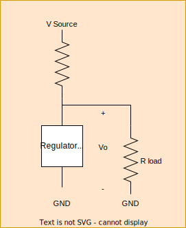

**Content Covered:** Lectures 1-18, Problem Sets 1-6, Seminars 1-7

### Ideal Diodes
- Unidirectional circuit element:
	- For *Positive* voltage (in anode to cathode direction), it passes current w/ no resistance, i.e acts like a *short circuit*.
	- For *negative* voltage, it acts like an infinite resistor, *open circuit*
	
	Remember that the anode is positive side, and cathode is negative (looks like a negative sign turned)

Notes on the diode: 
1. It is a highly nonlinear circuit element, unlike an ideal resistor, for example, the diodes i-v characteristic does not behave like a straight line: 
2. Nonlinear devices such as a diode are essential to signal processing & microelectronics
3. Most semiconductor diodes are based on the pn junction. Furthermore, pn junctions (Diodes), are found in nearly every electronic and optoelectronic device which is used.
4. Real diodes cannot conduct infinite forward current or withstand infinite reverse voltage. We will typically use resistors to limit current and voltage when using diodes

### Analysis of Non-linear Circuits

Previously, we have discussed linear circuit analysis, i.e loop, nodal and thevin and norton theorems. The basis of these theory's can *only* be invoked if every single element in a circuit has a linear i-v element, since they are based on **linear superposition**.

In order to solve circuit which contain *nonlinear* elements, these approaches will fail to yield effective results. We can utilize numerical computer based and graphical techniques to solve circuits. We can also use some other alternative methods:

***Linear relationships:***
$$v=ir,\;i=C\frac{dv}{dt},\;v=L \frac{di}{dt}$$
#### Trial and Error Method 
1. We can replace the non-linear element by a suitable linear model (which is valid for a certain range)
2. Solve the circuit using linear techniques and check for consistency with starting assumptions
3. If not valid, try a new model and start again

#### Trial and Error Method with Ideal Diodes
1. Replace each diode w/ short or open circuit
2. solve
3. check for feasibility

**Diode Feasible States:**

| Feasible States               | Non-Feasible States         |
| ----------------------------- | --------------------------- |
| OFF: $V_D\leq0 \;, \; i_D =0$ | $V_D>0$                     |
| ON:$V_D=0 \;, \; i_D \geq 0$  | $i_D<0$, $V_D<0,i_D \neq 0$ |
Essentially, we want to be looking for the diode to be conducting forward when voltage is zero, and not conducting with negative voltage

### Characteristics of Real Diodes
Some deviations of real diodes from ideal diodes:
1. A small forward bias of roughly 0.7V (for silicon diodes) is needed for the diode to behave like a short circuit. This voltage is referred to as the *cut-in* voltage
2. The diode cannot conduct unlimited forward current without undergoing some level of damage, thus a *diode has a max forward current rating*

**Reverse Bias!**
Diodes are not perfect open circuits under reverse bias (when a negative voltage is applied), we call the voltage required to exhibit reverse bias the breakdown voltage $v_{zk}$, this property means the current will pass freely in these conditions with a approximately fixed voltage drop - we *will utilize this property for voltage regulation*

Now, in the forward and reverse, but **NOT THE BREAKDOWN REGION**, we can express i-v relationship as follows:

$$i=I_s(e^{v/{nv_T}}-1)$$
Where n is between 1 and 2 and describes our ideality factor. We can also describe $v_T$ the thermal voltage:
$$v_T=\frac{kT}{q}$$
Although it is 25mv unless stated otherwise (condition under room temperature)

**Rule of Thumb** for silicon diodes the saturation current will double for about every five degrees Celsius that is applied to it.

The saturation current is also sometimes called the scale current because it scales with the diodes physical size. 

Finally, since the current grows exponentially as forward bias is applied to a real diode, the approximate of the short circuit becomes fairly accurate.

Voltage change to forward current change equation:
$$v_2=v_1=2.3nv_Tlog(\frac{I_2}{I_1})$$

#### Cut In Voltage Continued
The apparent threshold or turn on behavior under forward bias, is a result of the exponential i-v behavior within a diode. By plotting the current behavior on a scale, we can observe the cut in voltage.

For silicon diodes we can observe the following behavior:

##### How do we model the forward biased diode?
One such way is to utilize the constant drop model, which describes the diode as being a 0.7V source. This offers time inefficient and highly effective modelling of circuits which utilize diodes, albeit they are not exactly accurate.

This model is piecewise linear, and only slightly more complicated than the ideal diode model, allows for linear analysis to thus be used still. We can then compute the exact solution with a computer if necessary

## Steps for using 0.7V Model:
1. Replace each diode with a 0.7V diode source for on, or a open circuit for off
2. Solve the linear circuit
3. check with the feasibly and non feasible states

### Limiting and Protection Circuits
We can utilize diodes to limit voltage excursions, this can be used either to shape waveforms (rectifiers) or to protect sensitive circuitry. 

Consider this example here, when the voltage of the $V_0$ is equivalent to that of the voltage source below the diode, it will short circuit the path meaning vo cannot exceed v+.

### Zener Diodes
Zener diodes are special diodes which are designed to operate in reverse breakdown. These will enter the breakdown region when voltage has reached or is more negative then the diodes specific breakdown region. Two mechanisms can be responsible for this breakdown: 1. avalanche breakdown 2. Zener breakdown

The breakdown voltage $v_Z$ can be designed to be from a few volts to hundreds, depending on the desired use of the diode.

Zener diodes exhibit reverse notation of standard diodes, where we will define *positive voltage/current* in the *reverse direction*, additionally operating in breadkwon will not damage the zener however exceeding the max power dissipation will

Things to know:
1. Knee current $I_{ZK}$ this is the reverse current at the onset of breakdown
2. Max power dissipation $P_{ZMAX}$ this will be specified on the zener datasheet, do not exceed it
3. TEMCO - temperature coefficient $\frac{dV_Z}{dT}$
4. Breakdown curve: we can express the zener breakdown curve by a straight line with a slope of $\frac{1}{r_Z}$ where we define $r_Z=\frac{{\Delta V}}{\Delta Q}$(the incremental resistance)
5. $r_z$ is typically a few ohms, the smaller it is the better as it will enable more precise voltage regulation (more constant reverse V)
6. We can replace the zener diode operating in reverse breakdown by a linear circuit model described by: $V_{ZT}=V_{ZD}+r_ZI_Z$, where $V_{ZD}$ is the intercept of the tangent line with horizontal axis

### Small Signal Model
We can often breakdown voltages/currents into AC and DC components, we can describe this by splitting current into: $i_D(t)=I_D+id(t)$, where we can observe both the time varying and the fixed portions. 

*In this example we can observe the time varying components ic and the DC IC*

We will describe a fixed DC supply by $I_{DD} \;or\; V_{CC}$, and $I_c$ indicates the peak. In practice, we will observe that the *AC* component is typically **far smaller** then the DC component, thus we will denote this as the *small signal*

Now, for any nonlinear circuit, the response to a relatively small variation can be observed to be approximately linear. 

Here $\Delta V_{DD}$ describes the small excursion in the voltage source, if this is sufficiently small then we can describe the changes in voltage and current to be linearly related to this.

To solve a circuit like this we will do the following:
1. Use a 0.7V model and establish the bias point, we will also assume the change in the voltage source is zero 
2. Then assume the excursion from the source is a small signal,

Notes:
1. Valid for $v_d$ less then 5mV
2. This approx. is essentially the process of replacing the nonlinear i-v curve with its tangent

**Return to small signal analysis when doing practice midterm, decorby said this will be on the midterm** - see lecture 6 on eclass

### Voltage Regulation
A voltage regulator provides a nearly constant CD voltage to a load, even under the following circumstances:
1. The supply voltage feeding the regulator varies with time (i.e has ripples)
2. the effective load resistance (current drawn by load) varies with time

We observed that a single forward-biased diode can act as a simple voltage regulator, with $v_0=0.7V$. Regulated voltage of other values can be realized by connecting several other forward biased diodes in series to increase the voltage (however this isnt exactly ideal - power inefficient)

*Example of series diodes acting as a 2.1V regulator*, furthermore here the resistor is acting as a shunt resistor since it is paralleling the load

## Basic Regulator Circuit:

The top most resistor is considered our ballast resistor, we can describe this circuit with the following relationships:

## Zener Shunt Regulator
A Zener diode provides more flexibility in comparison to forward biased diodes in shunt regulators. 
1. Provided it remains in breakdown:
2. We must then design the circuit to ensure we keep the Zener in breakdown, thus we want to ensure that $V_Z \geq V_{ZD} \approx V_{ZK}$

### The pn Junction

*So how exactly are diodes created?*

A diode is essentially a pn junction with metal contacts, the *anode* is a contact to the p-type side and the *cathode* is a contact to the n-type side. The p and n type regions are formed within a **single piece** of crystalline silicone. We will further discuss the pn junction for other semiconductor devices (such as solar cells, leds, transistors)

**Semiconductors** - Exhibit intermediate conductivity between metals and insulators, recall the following formulas:

$R=\frac{\rho l}{A}$ this describes the resistance in terms of length, area and resistivity
$\sigma=\frac{1}{\rho}$ this describes the conductivity of a material

Silicon is a popular semiconductor because it can exhibit a change in conductivity of 6 orders of magnitude (from intrinsic to degen doped)

**Intrinsic SI** - refers to a sample of pure crystalline silicon, each silicon atom is covalently bonded to its four closest neighbors, in the dark and at low temperature, intrinsic silicon is perfectly insulating - no electrons are free to move

**Valence Electrons** - these are the electrons within an atom ***that take part in chemical reactions and bonding***, silicon has a total of 14 electrons, 4 of these are valence electrons and the other 10 are tightly bound to the Si atom 

**Covalent Bonds** - All bonding of atoms is driven by energy minimization, a covalent bond refers to the sharing valence electrons by neighboring atoms

**The Energy Band** - Quantum mechanics tell us the energy states available to a collection of matter, the band diagram is a schematic representation of the energy states available to the electrons inside a given material. Its vertical axis is electron energy. 

**EHP Generation** - if a electron gains sufficient energy, it can escape from its covalent bond. When this occurs, two free charge carriers are created (a pair). 
*Holes* are broken covalent bonds left behind when a e- escapes (empty states in valence band), this can be induced by various forms of energy.

**EHP By Electromagnetic Energy** - Radiation with the correct wavelength can create EHPs, the photon energy must be greater than $E_g$:

**EHP By Thermal Vibrational Energy** - At T>0 [k], atoms are in constant motion, and have thermal kinetic energy, lattice vibrations can thus occasionally break creating EHP

**Holes as Charge Carriers** - When a covalent bond is broken, the parent atom is left with a net positive charge, equal in magnitude to the electron charge. We call this a HOLE (h+) for short

Due to the thermal energy in a Si crystal, e- and h+ are in constant motion, when a e- and h+ meet the e- can fall into an empty VB state. The broken bond (hole) is repaired in the process. This is called electron hole pair recombination bc an e- and h+ are annihilated in the process - opposite of generation (but energy is released as heat or light - basis of led and laser)

**Intrinsic Carrier Concentration** At thermal equilibrium and in the dark the concentration of electrons and holes is constant with time. Covalent bonds are being broken and repaired at the same rate. We can thus write: $G=R$, where G is the generation rate and R is the recombination rate. G is strongly depending on temperature, whereas R is dependent on the number of e- and h+ per unit volume. If the semiconductor is crowded with e- and h+ they are more likely to meet. Thus we can write: $R\approx np$ where n is the concentration of e- and p is the concentration of h+.

In an intrinsic semiconductor there are an equal amount of e- and h+, so n=p=ni, where ni is the intrinsic carrier concentration 

**Doped (Extrinsic) Semiconductors** - Doping involves the intentional addition of impurity atoms to greatly increase the concentration of electrons or holes. This greatly impacts the conductivity while keeping the properties of the crystal unaffected.

#### N-Type Doping
The addition of a trace amount (1ppb-1ppm) of a pentavalent atom (such as phosphorous). Four of the impurity atoms valance electrons form covalent bonds with nearby Si atoms, while the fifth easily escapes the donor atom, thus one e- is donated. 

#### P-Type Doping
Trace amount of trivalent atom, (e.g boron), the three valance electrons form covalent bonds, leaving on unsatisfied bonding site, thus one h+ is donated 

**Review lecture 12 and 13 !!!!**

### Bipolar Junction Transistor (BJT)
Transistors are three terminal devices, the voltage at one terminal controls the flow of current between the other two terminals. The BJT is constructed from two pn junctions, npn or pnp, we refer to these junctions as the EBJ - emitter base junction and CBJ - collector based junction.

**NPN TYPE:**

**PNP TYPE:**

The BJT is a nonlinear device which has three operational modes in which we are interested in:

1. **Cutoff Mode** - EBJ and CBJ are in reverse
2. **Active Mode** - EBJ is FWD and CBJ is Reversed
3. **Saturation** - EBJ and CBJ are forward

Applications:
**Amplifiers:** Biasing of the BJT in active mode
**Digital Switches:** Toggle between cutoff and saturation modes of the BJT

Now, it is also important to note that emitter can be expressed as p+ or n+, as it is more heavily doped that the base in the BJT. The bipolar in BJT refers to the fact that operation requires both holes and electron currents. MOSFET has become standard, however we still utilize the BJT for the following reasons: 
1. better performance in applications combining HIGH power and frequency
2. More predictable for discrete circuit design

###### Active Mode Operation of the BJT
Consider a p+np BJT with a common base bias config, the base is common to the emitter sub-circuit and the collector sub-circuit. Now, DC sources $V_{EB},V_{CB}$ bias the two junctions. Thus for active mode we want $V_{EB}$ to be forwardly biasing the EBJ

#### High Level Description of Active Operation
1. Current flows easily across the forward biased Emitter-base junction, which is dominated by holes
2. Injected minority carriers (holes for p+np) case, diffuse across the neutral region of the base layer. The base is thin, so that most of the injected holes reach the edge of the CBJ depletion region; the strong field at the CBJT depletion region collects these minority carriers and drifts them across, producing a current in the collector sub-circuit
3. A small fraction of the injected minority carriers do recombine in the base, producing a current in the emitter base subcircuit, we can thus write:
$I_B=\frac{I_C}{\beta}$, $I_E=\frac{I_C}{\alpha}$, where $\beta$ is the common emitter current gain, and $\alpha$ is the common base current gain.

We can thus observe that the n+pn BJT works in a analogous but reversed way.

**Power Gain / Amplification**
- *So why is power gain possible?*
This effect is possible because the forward bias across the EBT determines the current thought the CBJ. As in, a small voltage drop across the EBJ produces a large current; most of this current flows through the CBJ, which has a much larger voltage drop

Therefore we can infer the following table values:

| Emitter             | Collector                                 |
| ------------------- | ----------------------------------------- |
| $V_{EB}\approx0.7V$ | $V_{CB}>V_{EB}$                           |
| Lower P             | Greater P since greater V (amplification) |

### Active Mode Currents $n^+pn$ Case
Collector Current: $i_c=I_se^{V_{BE}/V_T}$, where $I_s$ is the scale current of the BJT, its called that because it *scales* with the size of a device.

**Base Current** - $i_B=\frac{I_S}{\beta}e^{V_{EB}/V_T}=\frac{i_c}{\beta}$
**Emitter Current** - $i_E=\frac{I_S}{\alpha}e^{V_{BE}/V_T}$

We can find $\beta=\frac{\alpha}{1-\alpha}$, and alpha by reversing

Our main takeaways:
- In active mode, all currents are determined by $V_{BE}$ and approx independent of $V_{CB}$. We can think of the base as a 'valve' controlling current flow
- We want high $\beta$ (Gain parameter), which is achieved in practice by using a heavily doped emitter and a thin base layer.

### Active Mode of $p^+np$ Case
This is completely analogous to the operation of the above layout, but role of electrons and holes are *interchanged*, to forward bias EBJ and Reverse Bias CBJ (criteria of ACTIVE MODE), we must reverse the directions of the dc bias in the common base circuit. All of our equations are the same, but $V_{BE}$ is **replaced** by $V_{EB}$ 

We can note that in this cause emitter and collector current flow is reversed

### Large Signal Equivalent Circuit Models for BJT 
Collector terminal behaves as a nearly ideal dependent current source (only dependent on $V_{BE}$)
###### n+pn BJT
$i_I=I_se^{V_{BE}/V_T}=\alpha i_E=\beta i_B$, we will use the model most convenient to the circuit we are given

###### p+np BJT
replace $V_{BE}$ with $V_{EB}$ 

### Symbol Conventions for BJTS

*We can remember that the arrow goes into n terminals, from + to -*

We know that it will always be: $i_E=i_C+i_B$, currents will be in positive direction if their moving in the direction of the arrow. In **Active Mode** VBE/VEB is +ve

**In order to operate in active mode:** we need $V_{CB}\geq -0.4V$ for n+pn and $V_{BC}\geq -0.4V$ for p+np. Furthermore we need a "apparent threshold", voltage of 0.5V for it to conduct appreciably. 

**Rapid Analysis** we can replace VBE, or VEB in 0.7V

**Early Effect:**

**Alternative Common-Emitter Graph**
